<h1 align="center">🏎️ Car Clicker — Mobile 3D</h1>

<p align="center">
  A 3D mobile idle / clicker racing game built in <b>Unity 6</b> — tap to earn, build a garage of
  supercars, chase and escape the police, open reward chests, collect power-up cards and climb an
  online leaderboard.
</p>

<p align="center">
  
  
  
  
  
</p>

<p align="center">
  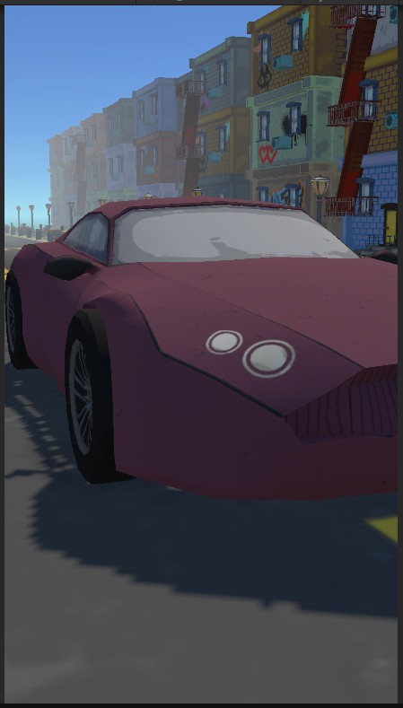
</p>

---

## 📖 About

**Car Clicker Mobile 3D** is a feature-rich idle/clicker game where the core tap-to-earn loop is wrapped
around a full 3D car fantasy: a cinematic garage, deep customization, a card-collection meta-game,
police-chase action sequences, and competitive online rankings.

The project is built on **Unity 6 (6000.2)** with the **Universal Render Pipeline (URP)** and a
**ScriptableObject-driven architecture** across ~**150 C# scripts**. Online features (leaderboard /
score submission) are powered by a **Supabase** backend with a TypeScript **Edge Function**.

> This repository is a **source-code showcase**. The heavy game content (3D models, textures, prefabs,
> scenes, audio, VFX) is intentionally kept out of version control to keep the repo lightweight and
> readable — see [Repository layout](#-repository-layout).

<p align="center">
  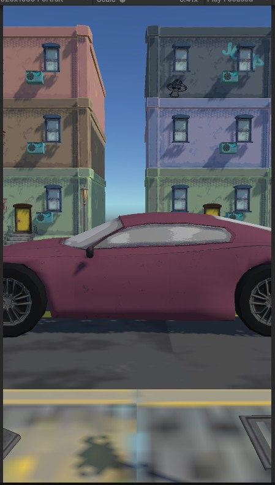
  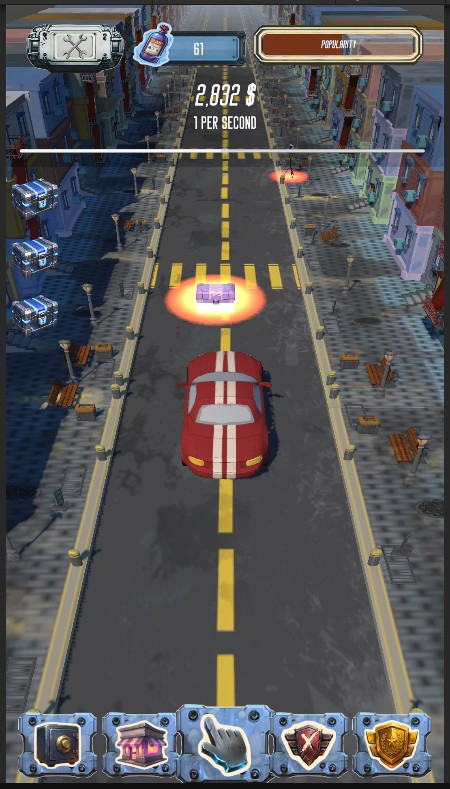
</p>

---

## ✨ Features

### 💰 Idle & clicker economy
Tap to generate income, then automate it. Passive **AutoIncome**, upgradeable income **buildings**, a
central **CurrencyManager**, floating click feedback and a fully custom **save system** per subsystem.

### 🚗 Garage & car customization
Browse, purchase and evolve a collection of supercars. Swap **body colors** and **parts**, preview
changes live, and watch cars evolve visually as you progress.

<p align="center">
  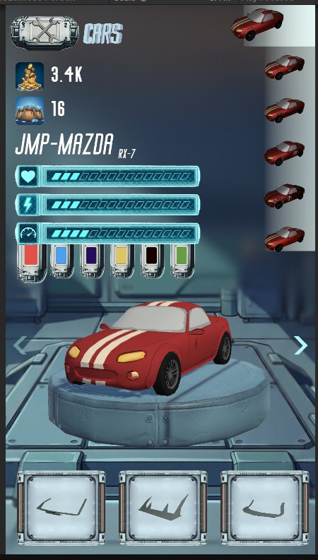
  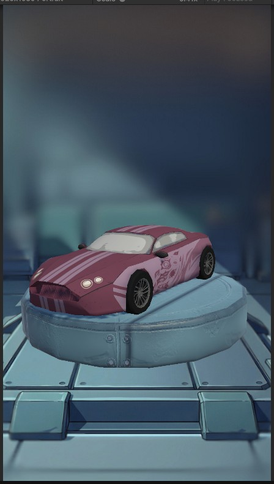
  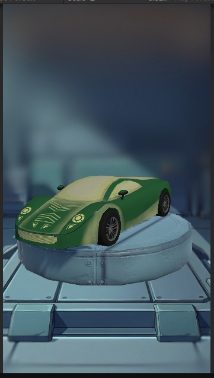
</p>

### 🎁 Chests & card collection (gacha)
Chests spawn during gameplay, are collected into an inventory, and open in a dedicated cinematic
scene. Rewards feed a **card-collection meta-game** — power-up cards (Nitro Rain, Pit-Stop Crew,
Wanted events and more) with rarities, drop-tuning and detail popups.

<p align="center">
  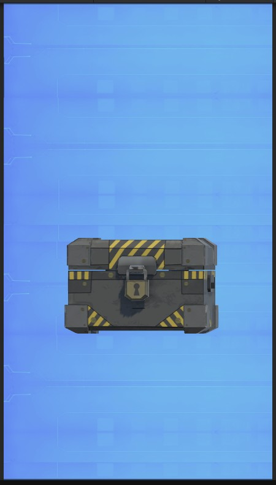
  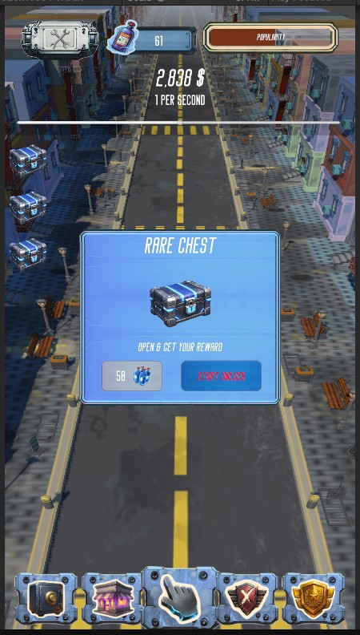
  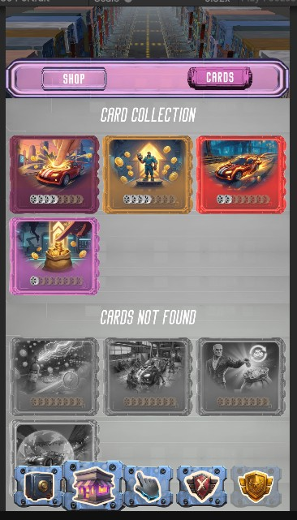
</p>

<p align="center">
  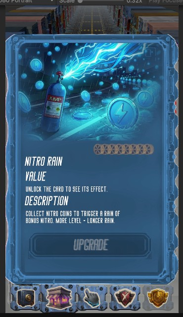
  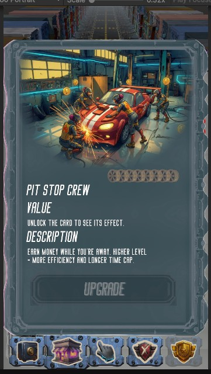
  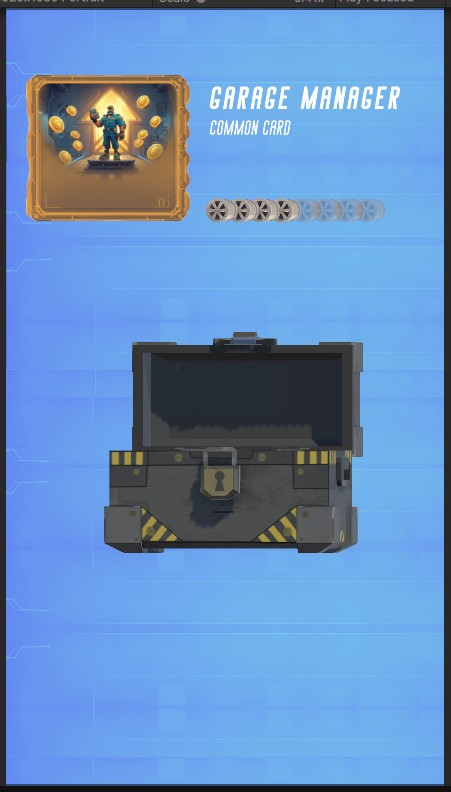
</p>

### 🚔 Police chase & action
Trigger-based **police catch** encounters with chase feedback, roadblocks and escape mechanics that
break up the idle loop with tense action moments.

<p align="center">
  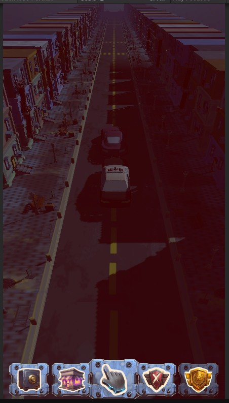
  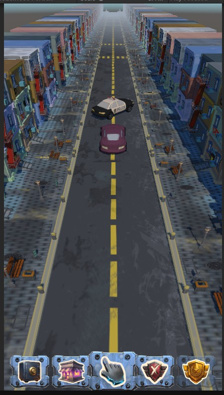
  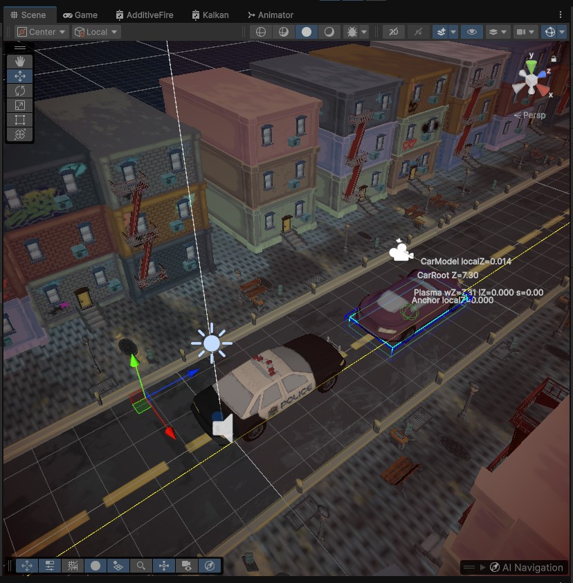
</p>

### 🔥 Boost / Nitro mode
A dedicated **Boost mode** with its own cinematic camera work, **post-processing** stack, VFX faders,
audio layer and collectible **Nitro coins** and **shield** pickups.

<p align="center">
  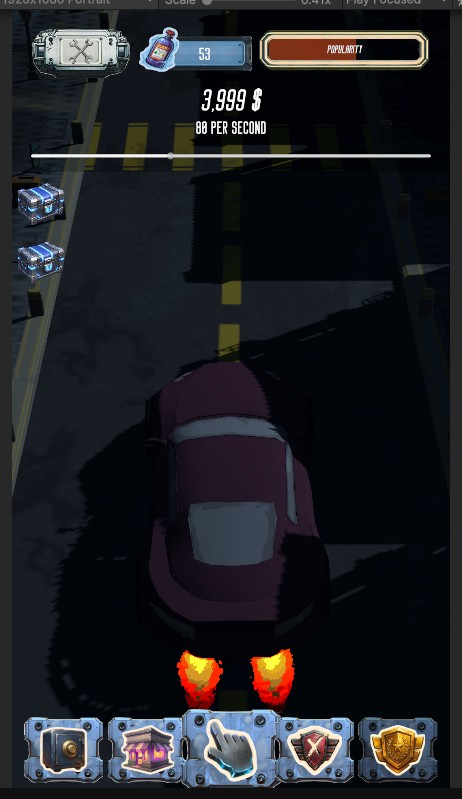
  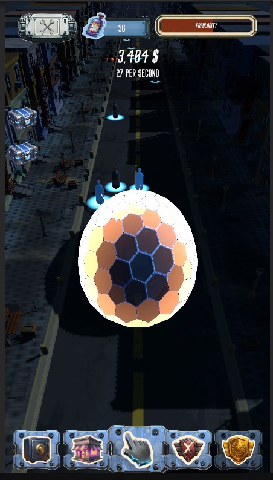
  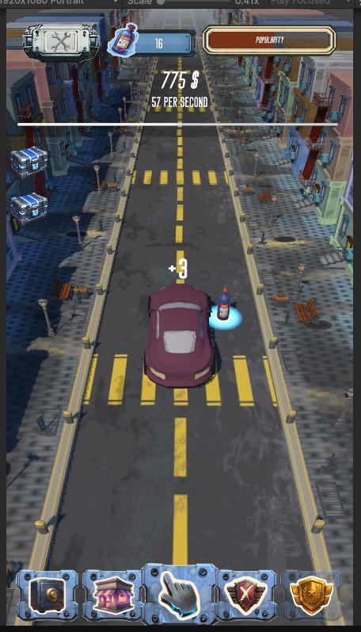
</p>

### 🎯 Blacklist missions
A tiered **Blacklist** progression (inspired by classic street-racing games): mission definitions,
tiers, reward tables, stat tracking and locked cars unlocked by clearing challenges.

<p align="center">
  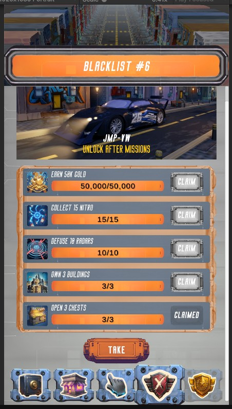
  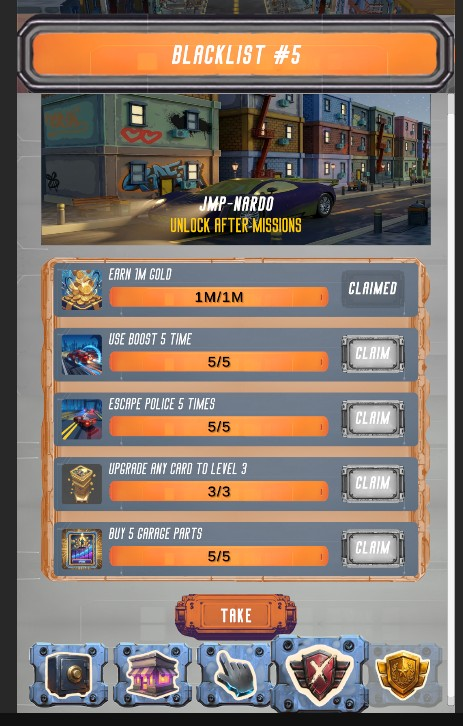
  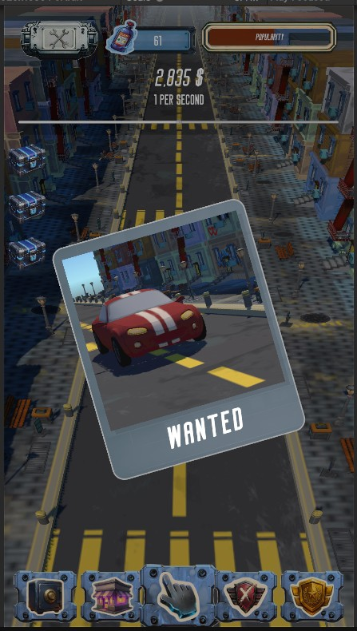
</p>

### 🏆 Online leaderboard
Global ranking with score submission validated server-side by a **Supabase Edge Function**, plus a
shop, **daily offers**, ad integration hooks, an **environment** system (ambient/heat profiles) and a
guided **tutorial** flow.

<p align="center">
  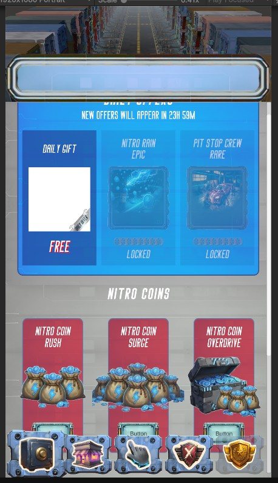
  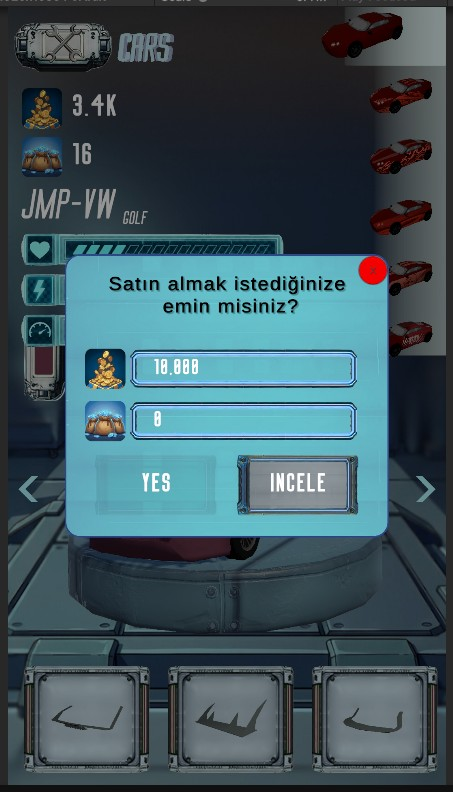
</p>

---

## 🛠️ Tech stack & architecture

| Area | Details |
|------|---------|
| **Engine** | Unity `6000.2.13f1` (Unity 6.2) |
| **Rendering** | Universal Render Pipeline (URP) + custom shaders & post-processing |
| **Language** | C# (~150 scripts) |
| **Design pattern** | Heavily **ScriptableObject-driven** data (definitions, tiers, themes, tuning) |
| **Backend** | Supabase (PostgreSQL) + TypeScript **Edge Function** for score submission |
| **Persistence** | Custom per-system save data models |
| **Target** | Android / mobile (3D) |

**Gameplay systems** are organized under `Assets/Scripts/`:

```
Scripts/
├── Blacklist/     Tiered mission progression, rewards & stat tracking
├── Cinematic/     Car showcase director & cinematic shot definitions
├── Environment/   Ambient/heat environment profiles
├── Garage/        Cars, customization, evolution, shop popups
├── Ranking/       Online leaderboard client (Supabase)
├── ShaderScripts/ Runtime shader/VFX controllers
├── Tutorial/      Guided onboarding flow
└── (core)         Economy, chests, cards, boost/nitro, police, save, ads…
```

---

## 🗂️ Repository layout

This repo is a **lean showcase**, not a fully buildable clone. It intentionally versions only:

```
Assets/Scripts/     Game source code (C#)
Assets/Shaders/     Custom shaders
Assets/Editor/      Editor tooling
Assets/SO/          ScriptableObject definitions
ProjectSettings/    Unity project configuration
Packages/           Package manifest
supabase/           Backend edge function + leaderboard SQL/tests
docs/               Screenshots, design docs & tooling scripts
```

Heavy binary content — **3D models, textures, prefabs, scenes, audio, fonts, VFX, third-party
plugins** — is deliberately excluded via [`.gitignore`](.gitignore) and preserved in an offline
project backup. As a result the repository stays a few MB in size instead of ~500 MB.

---

## 🚧 Development status

**In active development.** Core gameplay systems are implemented and functional; current work focuses
on **polish and balancing**:

- 🎨 Lighting / visual design pass (in progress)
- 🔊 Audio design & implementation
- 💹 Economy tuning & balance
- 🧭 Tutorial and onboarding text
- 🖥️ UI refinement

Design notes, audits and system guides for these efforts live under [`docs/`](docs/).

---

## 📄 Documentation

The [`docs/`](docs/) folder collects working design & audit documents produced during development —
economy tuning, save-system and audio audits, blacklist/UI inspections, balance change logs and the
audio design document — alongside the screenshot gallery used above.

---

<p align="center"><sub>Built with Unity 6 &amp; C#. Screenshots are from in-development builds and may change.</sub></p>
